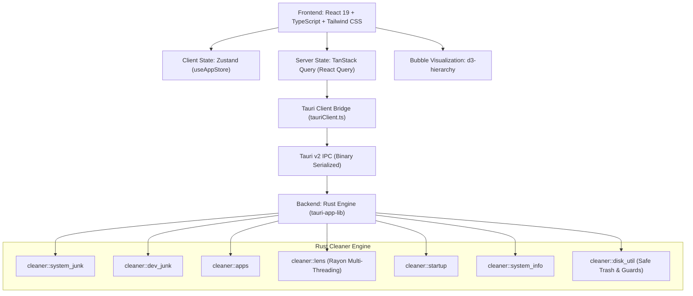

# Sikat Cleaner ⚡️

<div align="center">


<p align="center">
  <strong>The ultra-fast, privacy-first, 100% free macOS cleaner and system optimizer.</strong><br />
  A modern, open-source alternative to CleanMyMac built with Tauri v2, Rust, and React 19.
</p>

<p align="center">
  <a href="https://releases.cekcok.my.id/cekcok-releases/SikatCleaner.dmg">
    
  </a>
  <a href="https://releases.cekcok.my.id/cekcok-releases/sikat-latest.json">
    
  </a>
</p>

</div>

---

## ✨ Features at a Glance

### 🔮 1. Smart Care (1-Click Optimization)
- **All-in-One Analysis**: Scans system caches, developer build artifacts, application logs, and trash in seconds.
- **CleanMyMac Style Visuals**: Holographic rotating radar scanner with celebration confetti upon reclaiming gigabytes of disk space.

### 🪐 2. Space Lens (Interactive Bubble Visualizer)
- **Signature Bubble Map**: Visual circle-packing layout powered by `d3-hierarchy` where circle size is directly proportional to folder/file storage consumption.
- **Deep Drill-Down ("Dive In")**: Double-click any folder bubble or click **"Dive In"** to inspect its contents. Subdirectory sizes are computed concurrently across all CPU cores using multi-threaded Rust `rayon`.
- **Breadcrumb Navigation**: Seamlessly navigate back up the folder tree (`Macintosh HD > Users > user > CODE > ...`) with one-click location shortcuts (`Home`, `Downloads`, `Documents`, `Desktop`, `Movies`, `Applications`).
- **Quick Actions**: Inspect size percentages, reveal items in macOS Finder, or move bloated folders directly to the Trash.

### 🛠️ 3. Developer Junk Cleaner (For Software Engineers)
- **Xcode Cleanup**: Xcode `DerivedData`, iOS DeviceSupport debug symbols, and Simulator caches.
- **Package Managers**: Homebrew bottle cache, Rust Cargo crate archives, CocoaPods cache, and NPM/PNPM/Yarn tarball caches.
- **Mobile Development**: Android SDK & Gradle cache.
- **Rogue `node_modules` Scanner**: Deep-scans any custom workspace folder (e.g., `~/CODE` or `~/Projects`) to locate and clean neglected `node_modules` folders consuming dozens of gigabytes.

### 📦 4. App Uninstaller & Leftover Cleaner
- **Full App Deletion**: Scans `/Applications` for installed software.
- **Deep Leftover Hunter**: Discovers orphaned folders across `~/Library/Application Support`, `~/Library/Caches`, and `~/Library/Preferences` to eliminate lingering state that dragging to Trash leaves behind.

### 🧹 5. System Junk Cleaner
- Cleans user application caches (`~/Library/Caches`), macOS diagnostic crash dumps (`/Library/Logs/DiagnosticReports`), user logs (`~/Library/Logs`), and trash bins.

### 🚀 6. Startup Items & Launch Agents
- Inspects and manages background daemons and `LaunchAgents` (`~/Library/LaunchAgents` and `/Library/LaunchDaemons`) to keep macOS boot times lightning fast.

### ⚡️ 7. Performance & RAM Optimizer
- **Live Telemetry**: Real-time memory pressure and CPU load monitoring.
- **RAM Purge**: Reclaims inactive disk cache memory via macOS kernel `/usr/sbin/purge`.
- **DNS Cache Flush**: Flushes local DNS caches and restarts `mDNSResponder` in one click.

---

## 🛡️ Safety & Privacy First

> [!IMPORTANT]
> - **100% Offline & Private**: Zero telemetry, zero analytics, zero external network calls. All scanning and cleaning runs strictly on your machine.
> - **Safe Trash Operations**: Deleted files are sent to the native **macOS Trash** using the Rust `trash` crate — allowing you to easily **Put Back** any item if needed.
> - **System Protection Guards**: Built-in safeguards strictly prohibit deleting protected system roots (`/System`, `/usr`, `/Library`, `/Applications`, or the root user directory).

---

## 🏗️ Architecture & Tech Stack



| Layer | Technology |
|---|---|
| **App Runtime** | [Tauri v2](https://v2.tauri.app/) (Native macOS window with acrylic blur) |
| **Backend Core** | [Rust](https://www.rust-lang.org/) with `walkdir`, `rayon` (parallel multi-threading), `sysinfo`, `dirs`, and `trash` |
| **Frontend Framework** | [React 19](https://react.dev/) + [TypeScript](https://www.typescriptlang.org/) (Strict mode) |
| **State Management** | [TanStack Query v5](https://tanstack.com/query/latest) & [Zustand](https://github.com/pmndrs/zustand) |
| **Styling** | [Tailwind CSS v4](https://tailwindcss.com/) with Lucide Icons |
| **Bubble Packing** | [d3-hierarchy](https://d3js.org/d3-hierarchy) (Circle Packing algorithm) |

---

## 🚀 Getting Started

### Prerequisites

Ensure you have the following installed on your Mac:
1. **Node.js** (v20 or newer) & **pnpm** (`corepack enable pnpm` or `npm i -g pnpm`)
2. **Rust & Cargo** (`curl --proto '=https' --tlsv1.2 -sSf https://sh.rustup.rs | sh`)
3. **Xcode Command Line Tools** (`xcode-select --install`)

### 1. Clone the Repository
```bash
git clone https://github.com/jati251/sikat-cleaner.git
cd sikat-cleaner
```

### 2. Install Dependencies
```bash
pnpm install
```

### 3. Run in Development Mode
Launch the native desktop macOS app with hot reload:
```bash
pnpm tauri dev
```

Alternatively, to preview the frontend in a web browser (with automatic mock telemetry engine):
```bash
pnpm dev
# Open http://localhost:1420
```

### 4. Build Production Release (.dmg / .app)
To compile an optimized, signed macOS application bundle:
```bash
pnpm tauri build
```
The compiled `.dmg` and `.app` bundles will be located in `src-tauri/target/release/bundle/dmg/`.

---

## 📂 Project Structure

```text
sikat-cleaner/
├── src-tauri/                       # Native Rust Backend
│   ├── src/
│   │   ├── cleaner/                 # Core macOS cleaning modules
│   │   │   ├── apps.rs              # App uninstaller & deep leftover detection
│   │   │   ├── dev_junk.rs          # Xcode, Gradle, Homebrew, Cargo, npm
│   │   │   ├── disk_util.rs         # Safety guards & macOS Trash integration
│   │   │   ├── large_files.rs       # Flat large files scanner
│   │   │   ├── lens.rs              # Space Lens multi-threaded directory sizing
│   │   │   ├── startup.rs           # LaunchAgents & daemons manager
│   │   │   ├── system_info.rs       # RAM stats, /usr/sbin/purge, DNS flush
│   │   │   └── system_junk.rs       # System caches, logs, crash reports
│   │   ├── models.rs                # Data structures & contracts
│   │   └── lib.rs                   # Tauri IPC command registration
│   ├── Cargo.toml
│   └── tauri.conf.json              # Overlay acrylic window configuration
├── src/                             # React 19 Frontend
│   ├── app/                         # AppLayout & Sidebar
│   ├── components/ui/               # Button, Badge, Checkbox, Modal, ProgressBar
│   ├── features/                    # Feature Vertical Slices
│   │   ├── smart-scan/              # Smart Care Radar, Results, Confetti Celebration
│   │   ├── system-junk/             # System Junk View & TanStack Query
│   │   ├── developer-junk/          # Developer Junk & node_modules Scanner
│   │   ├── space-lens/              # Interactive Bubble Map & Breadcrumbs
│   │   ├── app-manager/             # App Uninstaller & Leftover Cleaner
│   │   ├── startup-items/           # Startup Items & Launch Agents
│   │   └── performance/             # Real-time RAM & SSD Performance Gauges
│   ├── lib/                         # TanStack Query client
│   ├── services/                    # Tauri client with mock fallback
│   ├── stores/                      # Zustand global state (useAppStore)
│   ├── types/                       # Shared TypeScript definitions
│   └── utils/                       # formatters, cn
```

---

## 📄 License

This project is licensed under the [MIT License](LICENSE). Feel free to fork, customize, and contribute!
